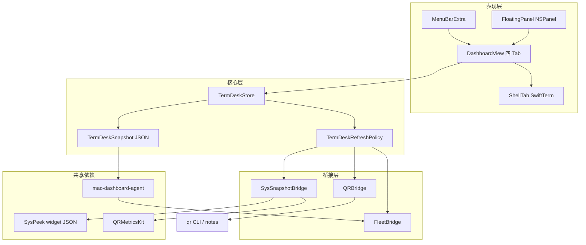
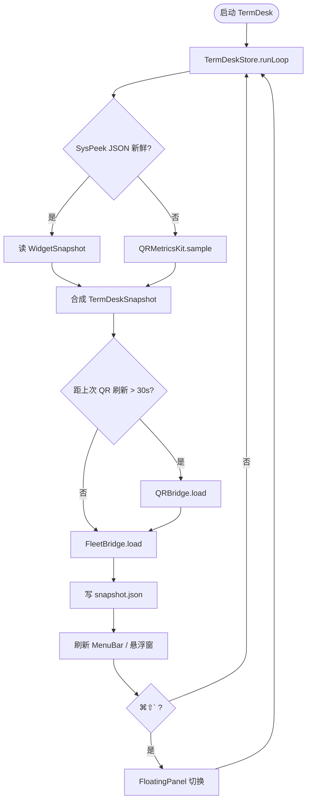
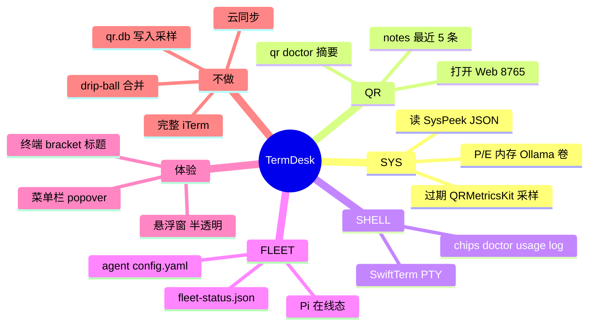

# TermDesk · 设计文档

> macOS 个人终端控制台。图解规范见 `~/QR/experiments/idea/docs/DIAGRAM-STANDARDS.md`。

---

## 概念图



**边界**：监控采样、Shell 输出、面板布局 **不** 写入 `qr.db`。

---

## 流程图



---

## 思维导图



---

## TermDeskSnapshot Schema

```json
{
  "updatedAt": "ISO8601",
  "sys": {
    "source": "SysPeek | TermDesk",
    "pCoreLoad": 0,
    "eCoreLoad": 0,
    "memoryPressure": "normal",
    "gpuActivity": "idle",
    "foregroundApp": "Cursor",
    "ollamaOnline": true,
    "ollamaModels": ["llama3"],
    "volumes": [{ "name": "TF", "connected": true, "freePercent": 42 }]
  },
  "qr": {
    "doctorOK": false,
    "issueCount": 4,
    "doctorLines": ["✓ ..."],
    "recentNotes": [{ "id": "x.md", "title": "...", "modifiedAt": "...", "preview": "..." }]
  },
  "fleet": {
    "agentConfigured": true,
    "lastPushAt": 1710000000,
    "lastPushChannel": "tailscale",
    "lastPushOK": true,
    "piURL": "http://100.x.x.x:8090"
  }
}
```
